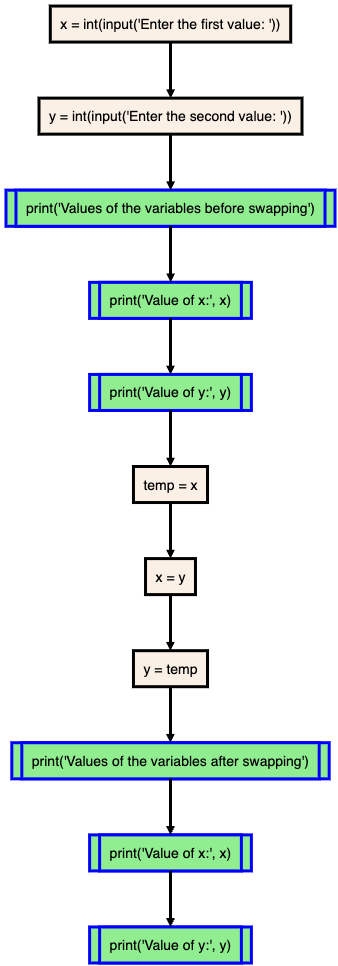

## 1. Write a program to swap two numbers using a third variable.

<!-- ### Flowchart
 -->

### Program
[Download Source Code](./p1.py ':ignore')
```python
x=(int(input("Enter the first value: ")))
y=(int(input("Enter the second value: ")))
print("Values of the variables before swapping")
print("Value of x:",x)
print("Value of y:",y)
temp=x
x=y
y=temp
print("Values of the variables after swapping")
print("Value of x:",x)
print("Value of y:",y)
```

### Output

```bash
Enter the first value: 15
Enter the second value: 25
Values of the variables before swapping
Value of x: 15
Value of y: 25
Values of the variables after swapping
Value of x: 25
Value of y: 15
```

